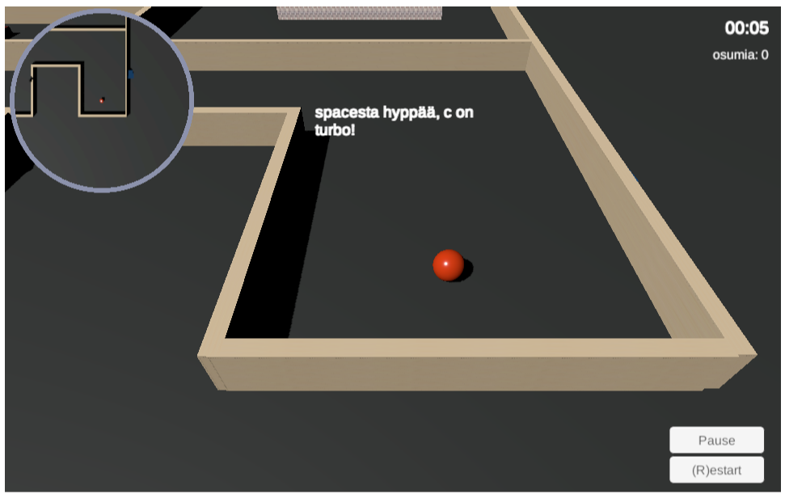
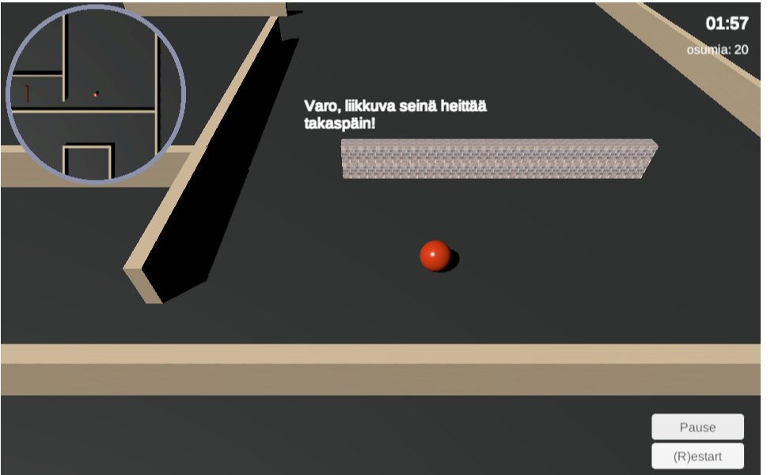

# Johdanto

Peliohjelmoinnin harjoitustyönä oli tarkoitus jatkaa Unityn Roll-a-ball- tutorialin pohjalta 3d-maailmassa tapahtuvaa pallopeliä, johon 
lisättäisiin isompi kenttä, ajanotto, esteitä ja vihollisia ja mitä kaikkea muuta matkan varrella mieleen tulisikaan ja mihin aika ja taidot riittäisivät.
Grafiikan osalta työ jätettiin hyvin pelkistetyksi koska grafiikan osuus arviointiin oli ohjeen mukaan vähäinen.

[Linkki peliin](https://student.labranet.jamk.fi/~N3998/Peliohjelmointi/Harkkabuild5/)

# Toteutus

Peliä tehdessä nälkä kasvoi syödessä, ja alunperin melko simppelistä projektista tulikin yllättävän moniominaisuuksinen peli. Alle lueteltuna tärkeimpiä ominaisuuksia:
- Pallolle lisätty hyppynappi spacesta ja hieman pomppimista. Ilmassa ei voi hypätä. Käytössä unityn uusi inputsystem.
- Pallolle lisätty turbonappi c josta tulee hetkellinen(Coroutine) *1.5 lisäboosti.
- Lisätty ajanotto (Unityn Time.time), ja seinään osumista tulee +2s lisää aikalaskuriin välittömästi. Seinäosumien määrä myös näkyy ruudulla.
- Pelaajalle tulee etenemisen mukaan ruutuun ohjetekstejä, jotka viipyvät ruudussa hetken (Coroutine).
- Lopussa tulee näkyville peliin käytetty aika ja lopputeksti ja jos pelasi alle minuuttiin tulee eri teksti.
- Pelissä on tynnyrimäisiä vihollisia jotka jahtaavat pelaajaa ja näin hidastavat menoa. Mitään pelaajan vauhdin hidastusvaikutusta niillä ei kuitenkaan ole vaikka välillä siltä vaikuttaa. Ne siis ainoastaan tulevat eteen ja sitä kautta ovat tiellä radan suorittamisessa.
- Siniset vihollispallot lähettävät pelaajan kentän alkuun pelaajaan osuessaan. Kello ei nollaudu.
- Punaiset seinät hidastavat pelaajan vauhtia hetkellisesti (Coroutine) neljännekseen.
- Liikkuvat seinät tönäisevät pelaajan takaisinpäin. 
- Kentän loppukaarteessa liian leveillä ajolinjoilla saa tyhjästä yhden seinän eteensä.
- Peliin lisätty Pause-nappi.
- Peliin lisätty Restart-nappi. Tämä on myös lopputekstin ohella näkyvissä radan läpipääsyn jälkeen. Toimii myös näppäimistön r-painikkeella.
- Peliin lisätty pyöreä minimap.
- Sivuttain liikkuvien seinien lisäksi myös matalat esteet nousevat ja laskevat paitsi viimeinen.
- Tärkeimmät asiat on tehty prefabeina joten niitä on helppo muokata.
- Peli loppuu kun keltaiseen leijuvaan kuutioon onnistuu hyppäämään.
- Mikäli kentältä ajautuu muurien toiselle puolen on siellä muutama ramppi joista pääsee takaisin, ja kauempana on näkymättömät seinät ettei 
pelialustalta pääse putoamaan.
- Pääosa tapahtumista on tehty onCollisionEnter ja siitä tagin tunnistuksella, muutamia myös triggereillä.

Jossain vaiheessa oli myös mielessä että olisinko tehnyt pelistä 3rd person camera- tyyppisen, 
mutta luovuin kuitenkin tästä ajatuksesta ajanpuutteen vuoksi. Myös jonkinlainen torjuntakeino sinisiä palloja vastaan olisi tarpeen
koska ne ovat erittäin ärsyttäviä. Scripteistä löytyy myös pois jätetty smooth camera, joka ei näyttänyt ollenkaan hyvältä.

# Hankalia asioita tai ongelmia:
- Kelloon ajan lisäämien osumasta tuotti aluksi hieman hankaluuksia. Myös UI:n buttonien kanssa oli aluksi hankalaa kunnes tajusin 
että loppuimage on niiden päällä läpinäkyvänä ja siksi eivät reagoi klikkaukseen.
- välillä 3d teki omistuisia asioita. Palloista tuli sikarinmuotoisia tai soikioita ja vihollisen pallot ikäänkuin leijuivat (ks. kuvat). Lopulta huomasin että kansiolla johon ne oli kerätty oli jostain syystä scalearvoissa muuta kuin ykkösiä. Selvisi siis sekin.
- kansiorakenne voisi varmaan olla vielä siistimpi. 
- WebGL-build teki pelin loputtua virheilmoituksen (ks. kuvat). Sen vuoksi poistin Application.Quitin ja tein sen sijaan niin että lopussa peli menee pauselle ja ainoastaan restart nappi jää käyttöön. En keksinyt mikä lopun ilmoitukseen on syynä mutta ilmeisesti WebGL-buildeilla on melko usein jotain ongelmia, ja koin ettei ole tämän kurssin asioita lähteä sen kanssa painimaan.
- Hidastavan seinän hidastava vaikutus jää joskus päälle.
- Myös tynnyrit tuntuvat ikään kuin hidastavan palloa ollessaan pallossa kiinni. En tiedä miksi.
- Tynnyrit renderöityvät välillä osin seinien läpi mikä hieman ärsyttää. Ilmeisesti collidereita pitäisi jotenkin säätää. Nyt ne ovat kuitenkin 
hieman pienempiä kuin itse tynnyri.
- Restart ei buildissa ihan joka kerta toimi kentän loputtua. Peli menee kyllä alkuun mutta ei käynnisty. Pausea painamalla saattaa herätä. Kerran ekalla latauksellakin eivät napit reagoineet, piti restartata. 
- En ole varma onko noita Coroutineja nyt käytetty miten fiksusti mutta sain kyllä niillä aikaan ihan ok toimivan pelin. Etenkin takaisin tönäisevan seinän olisi ehkä voinut tehdä ilmankin, nyt vaikutus kestää hieman liian kauan.
- Z-ulottuvuutta olisi voinut käyttää pelissä enemmänkin. 
- Grafiikoita olisi ollut kiva hieroa enemmän mutta minimap alkoi temppuilemaan. Jos esim. seinille laittoi jonkin tekstuurin, esim. tiiliseinän, 
ne eivät enää näkyneet minimapissa. Minimapin olisi kaiketi voinut tehdä myös staattisena niin että vain liikkuvat objektit päivittyvät.

# Onnistumiset ja yhteenveto
Mielestäni onnistuin tekemään peliin melko monipuolisia ominaisuuksia. Ulkoasu on mielestäni melko ok vaikka graafinen puoli jäi hyvin vähälle.
Lisäjuttuja tähän olisi voinut tehdä vielä vaikka kuinka, mutta jo nyt työhön on käytetty reilu 40h. Työ oli kuitenkin melko koukuttavaa ja hauskaa, 
ja myös opettavaista ja pelkän Unityn pyörittelyn lisäksi myös ihan perus koodaamista tuli tehtyä yllättävän paljon.
En ainakaan itse saanut peliä ihan heti rikki, joten se lienee melko vakaa. Tosin joku muu voi onnistua tässä huomattavasti paremmin.
Välipalautusarvioihin perustuen työ on mielestäni arvosanan 4 arvoinen. Lisäsin vielä turbon, pausen ja restartin viimeisen välipalautuksen jälkeen ja paransin ulkoasua. 

# Aikataulu

- projektin miettimisvaihe 2h
- 2.4: projektin aloitus, 2h
- 3.4: suunnittelua ja työstöä eteenpäin, 3h
- 4.4: radan rakentamista ja kellon kanssa painimista 3h
- 5.4: radan rakentamista ja liikkuvat lieriöt, kellon kanssa säätöä lisää 4h
- 6.4: liikkuvat seinät, colliderien ihmettelyä ja minimap 5h
- 11.4: Tekstit ja lopetus 5h
- 12.4: Eka build ja välipalautus 1h
- 14.4: Lisävastustajia ja hidastusansa 4h, muuta säätöä ja hieromista
- 15.4 bouncing ja wall bouncing, näkymätön seinä, restart, turbo ja muu säätö 4h
- 16.4 restart toimimaan myös buttonista. muuta säätöä. 3h.
- 17.4 dokumenttien tekoa, pausenappi, buildia ja loppusäätöjä. 5h.
- yht: 41h. 

# Kuvat

